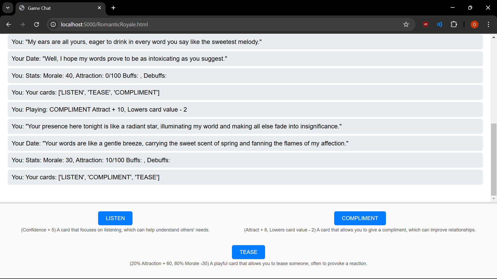

# Romantic Royale - madhacks_2024

To run the app simply run the flaskConnector.py and main.py.
After that head over to http://localhost:5000/RomanticRoyale.html, and have fun :)  
[AI usage is turned off by default. If you wish to use it, get a gemini key, and replace the first line of geminiKey.txt. Finally, change useAI in main.py to True]
